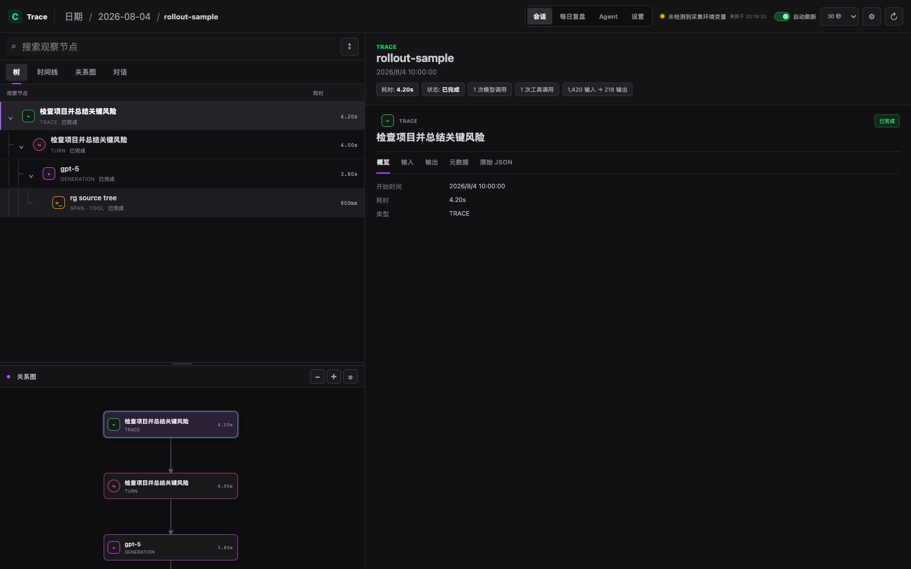
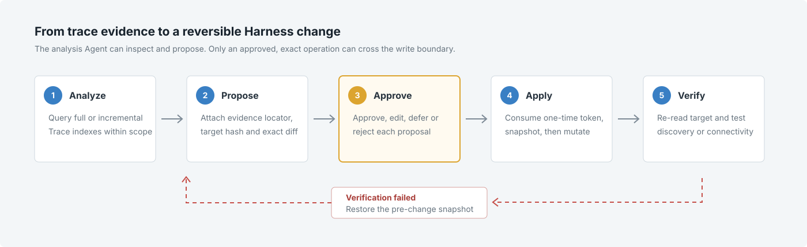
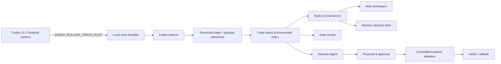

# Codex Trace Viewer



> 产品界面：从日期与 Session 总览进入单次 Trace，联动查看调用树、瀑布时间线、关系图、对话和节点详情。截图使用仓库内置示例数据，不包含用户隐私。

**把 Codex 的每一次工作，从一段聊天记录还原为可检索、可解释、可复盘的完整轨迹。**

[](./LICENSE)
[](https://nodejs.org/)
[](#隐私与安全边界)

Codex Trace Viewer 是一个面向 Codex 用户的本地可观测与 Harness 演进工作台。它读取 Codex rollout trace bundle，将原始事件归约为结构化状态，并提供日期、Session、Trace、时间线、关系图、对话和节点详情等多层视图。

在可观测能力之上，项目还提供一个受控 Agent：它从全量或增量 Trace 中寻找重复问题，基于证据提出对 AGENTS、Skills、MCP、Rules、Hooks、Plugins 和 `config.toml` 的改进建议。Agent 不能直接写入 Harness，只有经过用户逐项批准的精确操作才会被执行。

本项目不依赖 Langfuse、Docker、数据库或云端账号，原始 Trace 和分析结果默认保存在本机。

## 为什么需要它

Codex 的最终回答只呈现结果，却不会完整回答以下问题：

- 一次任务经历了多少个模型回合、工具调用和子任务？
- 时间主要消耗在模型、工具还是失败重试上？
- 哪些工具、Skill 和 MCP 被频繁使用，哪些已经长期闲置？
- 某次异常由哪个节点触发，其输入、输出和原始 Payload 是什么？
- 如何把长期使用反馈转化为可审计、可回滚的 Harness 改进？

Codex Trace Viewer 将事件日志、状态文件、工具结果和模型 Payload 重新组织为一条可以回读的证据链，使调试、复盘和能力演进建立在真实 Trace 上，而不是依赖主观印象。

## 核心能力

### Trace 采集与可观测

- 读取本地 Codex rollout trace bundle，不通过网络拦截会话。
- 识别运行中、等待归约、归约失败和已完成的 Session。
- 调用本机 Codex CLI，将 Raw bundle 显式归约为 `state.json`。
- 还原 Session、runtime turn、model generation、tool、MCP 与子任务层级。
- 展示耗时、Token、缓存、状态、错误以及原始 Payload 引用。
- 通过调用树、瀑布时间线、关系图、对话和详情面板联动排查问题。

### 本地索引与每日复盘

- 按日期、项目、模型、状态、意图和工具筛选 Session。
- 基于 Cursor 建立增量 Trace 索引，识别新增或发生变化的会话。
- 聚合模型、Provider、项目、工具、Skill、MCP、Token 与活跃时段。
- 识别失败调用、取消回合、重复工具调用和用户纠正反馈。
- 可选接入 OpenAI 兼容模型，从有限、脱敏的聚合数据中归纳使用习惯。
- 自动生成本地 JSON 与 Markdown 日报，不修改原始 Trace。

### Agent 编辑 Harness

Agent 的分析阶段只有 Trace/Harness 只读工具和 `proposal_create`，不开放 shell、任意文件写入或 Harness 修改工具。每条 Proposal 必须包含：

- 可回读的 Trace evidence locator；
- 明确的 Harness 目标与操作类型；
- 目标内容哈希与操作哈希；
- 修改前后差异及影响说明；
- 是否需要新 Session 生效的标记。

用户可以对每条建议执行批准、编辑后批准、拒绝或暂缓。审批令牌一次性使用、具备有效期，并与目标及精确操作绑定，避免审批后的操作被替换。

### Harness 受控自进化



> 自进化安全闭环：Agent 负责分析和提案，人工审批构成写入边界；执行前创建快照，写入后验证，验证失败时恢复到变更前状态。

Harness 变更遵循固定状态机：

```text
Analyze -> Propose -> Await Approval -> Apply -> Verify
                                      \-> Rollback on failure
```

当前受控适配器覆盖：

- 全局或项目级 `AGENTS.md`；
- 用户与项目 Skills；
- MCP Server 配置；
- Rules 与 Hooks；
- Codex `config.toml`；
- Plugins 的安装、更新、卸载与状态验证。

文件型对象支持精确快照和回滚；TOML 通过正式解析器校验，并尽量保留原文件布局。外部 CLI 操作无法可靠判断完成状态时，系统会停止自动恢复并要求人工核验。

## 整体架构



项目采用本地优先架构：

- **数据层**：文件系统中的 Trace bundle、日报、Agent Run、Proposal、Approval、Change 与 Snapshot。
- **归约层**：本机 Codex CLI 将 Raw trace 显式转换为可查询状态。
- **服务层**：Node.js HTTP 服务负责发现 Session、读取 Payload、生成复盘和编排 Agent。
- **界面层**：原生 Web 前端提供可观测工作区，Electron 负责桌面窗口、首次设置与生命周期管理。
- **演进层**：Agent 基于 Trace 证据提出建议，通过受控适配器修改 Harness 并完成验证。

Electron 主进程使用随机 loopback 端口启动本地服务，窗口关闭时同步停止服务；也可以绕过 Electron，直接以浏览器方式运行工作台。

## 30 秒开始使用

### 环境要求

- 能写入 rollout trace 的 Codex CLI 或本地 Codex App runtime；
- 从源码运行需要 Node.js 22 或更高版本；
- Windows 安装包用户无需单独安装 Node.js。

### 1. 安装并启动

从源码运行桌面版：

```bash
npm install
npm run desktop
```

只启动本地 Web 服务：

```bash
npm install
npm start
```

默认访问地址为 <http://127.0.0.1:4319/>。

构建 Windows 安装程序：

```powershell
npm install
npm run dist:win
```

安装包输出到 `dist/`，默认创建桌面和开始菜单快捷方式。

### 2. 配置 Trace 目录

首次打开 Electron 应用时，设置向导会自动检测 Codex CLI，并允许选择：

- Codex CLI 路径；
- rollout trace 目录；
- 日报与 Agent 数据目录；
- Codex home 目录。

也可以手动配置环境变量。Windows PowerShell 示例：

```powershell
$traceRoot = "E:\codex\.codex-traces"
$insightsRoot = "E:\codex\.codex-insights"

New-Item -ItemType Directory -Force $traceRoot, $insightsRoot | Out-Null
[Environment]::SetEnvironmentVariable("CODEX_ROLLOUT_TRACE_ROOT", $traceRoot, "User")
[Environment]::SetEnvironmentVariable("CODEX_INSIGHTS_ROOT", $insightsRoot, "User")
```

修改用户级环境变量后，需要完全退出并重新打开 Codex CLI 或 Desktop App，使新进程继承配置。

### 3. 产生并查看 Trace

运行一次 Codex 任务后，Trace 根目录中会出现类似结构：

```text
.codex-traces/
└── trace-.../
    ├── manifest.json
    ├── trace.jsonl
    ├── payloads/
    └── state.json       # 完成归约后生成
```

Ready Session 可以直接打开。Raw Session 完成写入后可由界面触发归约；仍在运行的 bundle 不会被静默改写。

## 数据目录

Trace Viewer 不会把 Agent 状态写入原始 Trace。默认数据布局如下：

```text
.codex-insights/
├── agent/
│   ├── runs/
│   ├── proposals/
│   ├── approvals/
│   ├── changes/
│   ├── snapshots/
│   ├── analysis-index/
│   ├── trash/
│   └── metadata.json
├── reports/
└── settings.json
```

Agent JSON 采用同目录临时文件加原子重命名写入，并包含 schema 迁移。服务重启后，Run、Proposal、Approval 和 Change 状态会继续保留。

## 模型服务

每日复盘与 Agent 共用一套 OpenAI 兼容模型配置，但拥有独立开关。可在“设置 -> 模型服务”中配置：

- API Base URL；
- 可选 API Key；
- 模型发现与选择；
- 5 至 600 秒请求超时；
- 每日复盘与 Agent 分析开关。

模型调用失败、超时或返回无效 JSON 时，规则日报仍会保存并明确标记降级状态。发送给模型的是有上限的聚合指标、Top 使用项和经过裁剪、脱敏的样例；原始 Payload、完整源码和命令输出不会默认进入日报分析请求。

## Agent 运行边界

每次 Agent Run 可以配置：

- 全量或基于 Cursor 的增量模式；
- 回看天数与项目白名单；
- 是否允许按需读取 Payload；
- 最大分析轮次、累计 Token 和运行时长；
- 工具结果、输入内容与 Payload 字节预算。

失败或手动停止的增量 Run 不会推进 Dashboard 的分析基线，恢复时仍从原始 Cursor 重新分析，避免遗漏 Trace。

## CLI 参数

| 参数 | 默认值 | 说明 |
| --- | --- | --- |
| `--trace-root <path>` | `CODEX_ROLLOUT_TRACE_ROOT` 或 `./traces` | rollout trace bundle 根目录 |
| `--data-root <path>` | `CODEX_INSIGHTS_ROOT` 或 `./.codex-insights` | 日报、设置与 Agent 数据目录 |
| `--codex <executable>` | `codex` | Raw bundle 归约使用的 Codex CLI |
| `--codex-home <path>` | `CODEX_HOME` 或 `~/.codex` | Harness inventory 来源 |
| `--host <address>` | `127.0.0.1` | HTTP 监听地址 |
| `--port <number>` | `4319` | HTTP 监听端口 |

示例：

```bash
node server.mjs \
  --trace-root /path/to/.codex-traces \
  --data-root /path/to/.codex-insights \
  --codex-home /path/to/.codex \
  --port 4319
```

## Codex CLI、Desktop App 与云端会话

本项目读取本地文件，而不是拦截网络请求：

```text
Codex CLI / local Desktop runtime
              |
              | CODEX_ROLLOUT_TRACE_ROOT
              v
       local trace bundle
              |
              v
       Codex Trace Viewer
```

- **Codex CLI**：只要进程继承 `CODEX_ROLLOUT_TRACE_ROOT`，即可写入本地 trace bundle。
- **Codex Desktop App**：建议配置用户级环境变量，并完全退出包括托盘在内的旧进程后重启。
- **云端 Codex / ChatGPT 网页会话**：不会写入本机 Trace，因此不属于当前采集范围。

最终是否产生 Trace，取决于当前 Codex runtime 是否支持 rollout trace。

## Windows 开机启动

希望本地服务在登录后自动启动时，可运行：

```powershell
powershell -ExecutionPolicy Bypass -File .\install-windows.ps1
```

移除登录任务：

```powershell
powershell -ExecutionPolicy Bypass -File .\uninstall-windows.ps1
```

## 常见问题

### 页面没有 Session

确认 `--trace-root` 或 `CODEX_ROLLOUT_TRACE_ROOT` 指向包含 `trace-*` 子目录的位置，并检查每个目录中是否存在 `manifest.json`。

### Raw Session 无法归约

确认 Session 已结束、Trace 文件不再增长，并检查设置中的 Codex CLI 路径是否可执行。仍在运行的 Session 不会被强制归约。

### Desktop App 没有产生新 Trace

完全退出 Desktop App 及托盘进程，确认用户级环境变量已经生效后再启动。`codex app` 只负责打开桌面应用，是否写入 Trace 取决于应用内部 runtime。

### Skill 或 MCP 没有出现在日报中

日报只能统计 Trace 中真实记录的调用。仅安装但未使用的能力会进入 inventory 和长期未使用建议，不会被计入使用次数。

## 隐私与安全边界

- 默认绑定 `127.0.0.1`，不对公网开放服务。
- 不要求 Langfuse、数据库、遥测平台或云端账号。
- 原始 Trace、日报和 Agent 状态默认保存在本机。
- API Key 只写入本机设置文件，设置接口不会返回明文 Key。
- Trace 搜索、Evidence 和 Harness 检查会对常见密钥字段进行脱敏。
- Payload 按需读取，并受开关和字节预算限制。
- Agent 分析阶段没有写入工具，所有变更都必须经过显式审批。
- 应用前创建快照，验证失败自动恢复；已完成 Change 支持用户确认后回滚。

清理建议不会自动删除 Skill、MCP、日报或 Trace bundle。

## 开发与测试

运行测试：

```bash
npm test
```

测试覆盖 Trace 服务、Payload 读取、Raw bundle 归约、日报生成、LLM 兼容接口、增量索引、Agent 状态机、审批令牌、受控 Harness 修改、验证、失败恢复与回滚等关键路径。

主要模块：

| 模块 | 职责 |
| --- | --- |
| `server.mjs` | 本地 HTTP 服务、Trace API 与静态资源 |
| `trace-query.mjs` | Trace 索引、查询、聚合与 Evidence |
| `insights.mjs` | 本地日报、统计与设置 |
| `llm-review.mjs` | OpenAI 兼容模型服务 |
| `agent-engine.mjs` | Agent 分析循环与只读工具编排 |
| `agent-service.mjs` | Proposal 决策、应用、验证与恢复 |
| `agent-store.mjs` | Agent 状态持久化与 schema 迁移 |
| `harness-tools.mjs` | Harness 发现、读取、哈希与脱敏 |
| `harness-mutations.mjs` | 受控修改、快照、验证与回滚 |
| `desktop/` | Electron 窗口、设置向导与桌面生命周期 |
| `public/` | Web 工作台界面 |

## 项目范围与许可证

本仓库包含独立 Viewer、本地服务、Electron 桌面壳、首次设置向导、日报分析、Harness Agent、Windows 打包配置、测试与示例 fixture。

它不包含 Codex 源码、用户的本地 Trace 数据，也不隶属于 OpenAI、Codex 或 Langfuse。界面借鉴了现代可观测平台的交互方式，但不嵌入或依赖 Langfuse。

[MIT License](./LICENSE) © 2026 Jin Zhangzheng

项目主页：<https://github.com/Jane-o-O-o-O/Make-Codex-Your-Own>
